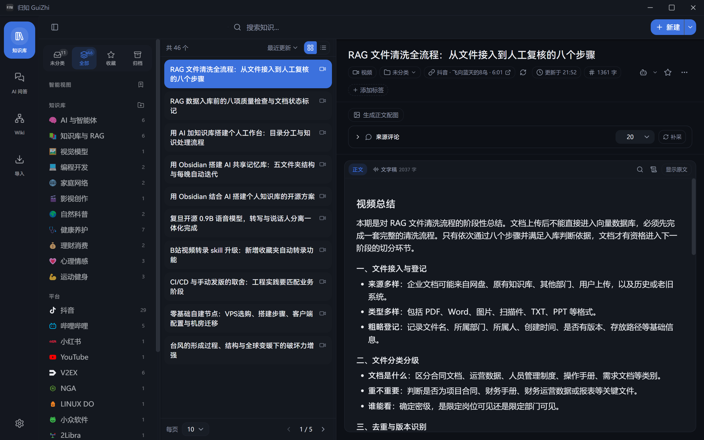
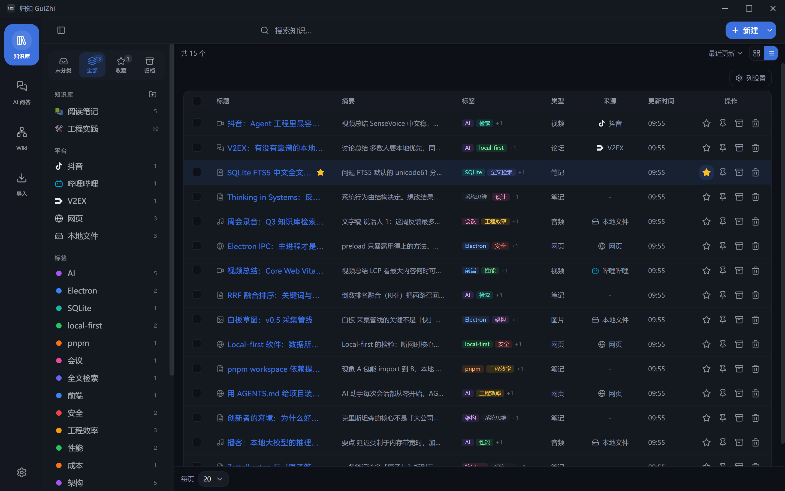

<p align="center">
  
</p>

<h1 align="center">归知 GuiZhi</h1>

<p align="center"><strong>让信息归于知识 —— 本地优先的 AI 个人知识库</strong></p>

<p align="center">
  <a href="https://github.com/Couleur-Share/GuiZhi/releases/latest"></a>
  <a href="./LICENSE"></a>
  <a href="#下载安装"></a>
</p>

<p align="center">
  
  
  
  
  
</p>

---

一段文字、一个链接、一张截图、一段录音、一条 B 站视频——归知把它们统一收进本机的
SQLite，交给 AI 做摘要、打标签、编织成互相链接的 Wiki 页面网络，再用
「关键词 + 语义」混合检索把它们找回来，并基于你自己的资料回答问题。

不需要账号，不上传云端。只有你主动配置的模型调用会走网络，其余一切留在本地。

<p align="center">
  
</p>

## 下载安装

前往 [Releases](https://github.com/Couleur-Share/GuiZhi/releases/latest) 下载对应安装包：

| 平台 | 安装包 |
| --- | --- |
| Windows x64 | `GuiZhi-Setup-<版本>-x64.exe` |
| Windows arm64 | `GuiZhi-Setup-<版本>-arm64.exe` |
| Linux x64 | `GuiZhi-<版本>-x64.AppImage` / `GuiZhi-<版本>-amd64.deb` |

安装包暂未做代码签名，Windows SmartScreen 弹提示时选择「更多信息 → 仍要运行」。
macOS 版本待签名证书就绪后提供。

首次启动会自动检测旧 .NET 版的 `guizhi.db`，并提供一键迁移。

## 支持的采集平台

粘贴链接或分享口令即可采集。侧栏「平台」分区按来源分组；认不出专用连接器的 URL
走通用网页抓取。

| 类型 | 平台 | 能力概要 | 备注 |
| --- | --- | --- | --- |
| 视频 | 哔哩哔哩 | 元数据 + 音轨 → 转写 / 总结 / AI 标题 | 需 yt-dlp；认 `/video/` 与 `b23.tv` |
| 视频 | YouTube | 同上 | 需 yt-dlp；认 `/watch`、`/shorts/`、`youtu.be` |
| 视频 / 图文 | 抖音 | 视频转写总结；图文配图入库 + 逐图 OCR | **不走 yt-dlp**；可用分享口令整段粘贴 |
| 图文 / 视频 | 小红书 | 图文配图 + OCR；视频笔记同链路 | **不走 yt-dlp**；须用分享面板带 `xsec_token` 的链接 |
| 论坛 | **V2EX** | 正文 + 全部回复 + AI 讨论总结 | **目前唯一支持的论坛**；走官方只读 API |
| 通用 | 网页 | Readability → Markdown | 无专用连接器的 URL 都落这里 |
| 通用 | 本地文件 | 文本 / 图片 / 音视频拖入即入库 | 媒体资产化，详情页可预览播放 |

未支持的例子：其它论坛（Discourse、linux.do、Reddit 等）、需要登录才能看的内容
（平台 cookies 采集尚未实现）、小红书地址栏手抠的无 token 链接。

## 功能

### 采集 · 收进来只要一步

- **快速采集**：快捷键 `Alt+Shift+N`（默认应用内生效，可改为全局）、托盘菜单、
  顶栏「新建」三种入口；粘贴文本、链接或分享口令自动识别类型，也可开空白笔记
- **拖进来就行**：文本 `.txt/.md`、图片 `.png/.jpg/.webp/.gif/.bmp`、
  音频 `.mp3/.wav/.m4a/.aac/.ogg/.flac`、视频 `.mp4/.webm/.mkv/.mov/.avi`
- **网页正文抽取**：Readability 抽正文 → Turndown 转 Markdown，全程 SSRF 防护；
  抓取失败自动降级为「保存链接」
- **在线视频与图文**：见上表。B 站 / YouTube 经 yt-dlp；抖音 / 小红书走专用解析；
  配好转写模型后视频可一路做到文字稿 + 结构化总结 + AI 标题
- **论坛帖**：目前仅 V2EX；回复完整入库，可生成讨论总结，详情页可重新生成
- **导入队列**：并发 2、落库持久化、重启自动恢复、可取消可重试；
  任务行显示阶段耗时，详情弹窗可复制诊断信息
- **去重**：规范化 URL + 内容哈希；撞车时可打开已有条目或仍要创建副本

### 知识库 · 两种视图，检索优先

- **卡片视图**：虚拟化列表 + 常驻详情面板，中间栏宽度可拖拽
- **列表视图**：全宽表格，列可显隐、可拖拽调宽、服务端分页，详情在全屏弹窗打开
- **范围与整理**：未分类 / 全部 / 收藏 / 归档 / 回收站；知识库 + 标签；
  侧栏另有「平台」分区（抖音 / B 站 / 小红书 / YouTube / V2EX / 网页 / 本地文件）
- **批量操作**：Ctrl/Cmd 点选、Shift 范围选，批量移动 / 归档 / 回收站 / 恢复 / 彻底删除
- **编辑**：CodeMirror 6 Markdown 编辑与预览双模式，「正文 / 文字稿」双 Tab，
  防抖自动保存（可关掉改用 `Ctrl+S`）
- **检索**：SQLite FTS5 中文按字分词 + 英文前缀匹配，BM25 加权排序（标题 > 标签 > 正文）
- **AI 交接稿**：把一条条目序列化成自包含 Markdown，复制到 Cursor / Codex 等对话框；
  也可另存为文件

<p align="center">
  
</p>

### AI · 六条模型路由，各司其职

在「设置 → 模型服务」里配置服务商与模型，然后把模型分配给六条路由：

| 路由 | 用途 |
| --- | --- |
| 主文本模型 `mainText` | 知识问答、Wiki 编译、音视频 / 论坛总结 |
| 快速模型 `fastText` | 摘要、自动打标签、文字稿排版 |
| 视觉模型 `visionText` | 图片 OCR |
| 嵌入模型 `embedding` | 语义检索向量（不配则检索退化为纯全文） |
| 语音转写 `audioText` | 音视频转文字 |
| 正文配图 `imageGen` | 文生图（专用，不参与对话） |

在此之上提供的能力：

- **AI 问答**：Agent 工具循环（`search` / `read` / `answer`），没读过来源就拒绝作答；
  回答带可跳转引用；会话落库
- **混合检索**：FTS 与 embedding 并行召回、RRF 融合；embedding 未配置时静默退化为纯 FTS
- **摘要与标签**：短文单发、长文 map-reduce；一键生成可点选的标签建议
- **图片 OCR**：识别结果作为「图中文字」写入正文，进入全文与语义索引
- **音视频转写**：远程 `/audio/transcriptions`，或安装本地 FunASR；
  可选说话人分离（本地引擎，默认关）
- **正文配图**：先策划后逐张生成，风格可编辑；设置页「正文配图」与条目面板共用同一套预设

支持 OpenAI 兼容 / Gemini / Anthropic 三种协议，内置多家服务商预设，也可填自定义端点。

### Wiki · 让条目长成知识网络

- AI 把知识条目**增量编译**为互链的 Wiki 页面（主题 / 实体 / 概念三类）
- `[[链接]]` 经白名单清洗，自动生成反向链接与来源条目回溯
- 指纹 = 素材哈希 + 提示词版本，只编译真正变过的部分
- **关系图谱**：力导向图展示页面网络，点节点直达页面
- 问答检索融合 Wiki：页面优先命中，读页面时出链与来源成为新线索

### MCP · 让外部 AI 直接搜你的知识库

「设置 → MCP 接入」：独立进程只读打开本机数据库，归知不必正在运行。

- 两个工具：`search_knowledge`（FTS）、`read_item`（交接稿全文）
- Cursor 一键写入配置；Codex 提供安装命令
- 可按知识库限制可见范围（私人日记等可排除）

### 本地工具链 · 应用内一键安装

三个可选外部工具都不打包进安装包，需要时在「设置 → 常规 → 采集」里一键装：

| 工具 | 用途 | 平台 |
| --- | --- | --- |
| yt-dlp | B 站 / YouTube 解析与音轨下载 | 全平台 |
| ffmpeg | 音频转码为 16kHz 单声道再送转写 | Windows 一键装，其他平台用包管理器 |
| FunASR (SenseVoiceSmall) | 完全离线的本地语音转写 | 仅 Windows |

FunASR 装完会自动写入内置 Provider 并接管 `audioText` 路由；服务按需拉起，不常驻。

### 数据 · 全在你自己手里

- **备份 / 恢复**：在线一致性快照，手动 + 定时；恢复前再存一份当前数据
- **Markdown 导出**：每条一个 `.md` + YAML frontmatter，按知识库分文件夹
- **配置迁移**：导出全部软件设置（模型、路由、配图风格、快捷键、外观、MCP 范围等）；
  API Key 可选加密带走。与备份分工是「备份装条目、配置装设置」
- **旧版迁移**：一键把 .NET 时代的 `guizhi.db` 全量迁入

### 界面

明色 / 暗色 / 跟随系统，6 套莫兰迪主题色加自定义色，3 档字号，
背景图（透明度 + 模糊可调），动效三档强度，简体中文 / English。

## 快速上手

1. 装好后按 `Alt+Shift+N` 试一次快速采集：粘一个网页链接或 V2EX 帖子地址，
   看它落进「未分类」
2. 打开「设置 → 模型服务」，加一个服务商，至少把**主文本**和**快速**模型分配上
3. 想要语义检索再配**嵌入**，想 OCR 配**视觉**，想转写配**语音转写**，
   想正文配图配 **imageGen**
4. （可选）「设置 → MCP 接入」把归知接到 Cursor，让 IDE 里的 AI 直接搜库
5. 攒够几十条后，去 Wiki 模块点「立即编译」

没配 AI 也能用：采集、编辑、标签、全文检索、备份导出都不依赖模型。

## 快捷键

| 动作 | 默认组合 | 默认作用域 |
| --- | --- | --- |
| 显示 / 隐藏应用 | `Alt+Shift+P` | 全局 |
| 快速采集 | `Alt+Shift+N` | 应用内 |
| 搜索 | `Alt+Shift+F` | 应用内 |
| 打开设置 | `Alt+Shift+S` | 应用内 |

四个动作都可以在「设置 → 快捷键」里改组合键，并单独切换全局 / 应用内生效。

## 数据目录

```text
%APPDATA%/GuiZhi/            # Windows；Linux 为 ~/.config/GuiZhi
├─ data/
│  ├─ knowledge.db           # 主数据库（SQLite + FTS5 + 向量表）
│  ├─ guizhi.db              # 旧 .NET 版数据库（只读迁移源）
│  └─ assets/                # 导入的图片 / 音视频 / 附件
├─ config/
│  ├─ ai-models.json         # 服务商、模型与路由配置
│  ├─ illustration-styles.json
│  ├─ mcp.json               # MCP 可访问的知识库范围
│  └─ shortcuts.json
├─ backups/                  # knowledge-{manual|auto|pre-update|pre-restore}-*.db
├─ tools/                    # 按需安装的 yt-dlp / ffmpeg / FunASR
└─ logs/
```

数据根目录可以在「设置 → 数据」里迁到别处。

## 从源码构建

需要 Node.js ≥ 24、pnpm ≥ 11。

```bash
pnpm install

# 开发（Vite HMR + Electron）
pnpm electron:dev

# 质量门禁
pnpm lint          # eslint + 文件行数门禁
pnpm typecheck     # TS 全量检查
pnpm test:unit     # vitest 单测
pnpm test:e2e      # Playwright 真实 Electron 冒烟

# 打包（须用 pnpm build，含 MCP 产物；不要只跑 vite build）
pnpm electron:build:win
pnpm electron:build:linux
```

## 仓库结构

```text
GuiZhi/
├── apps/desktop/
│   └── src/
│       ├── main/        # Electron 主进程：窗口/托盘、SQLite、IPC、采集与媒体
│       ├── preload/     # contextBridge 白名单
│       ├── renderer/    # React UI：library / ask / wiki / imports + 设置
│       └── mcp/         # 独立 MCP server（随应用打包）
├── packages/
│   ├── core/            # AI 配置与客户端、运行时路径
│   ├── db/              # SQLite 适配器、schema、迁移
│   └── shared/          # 跨进程类型、IPC 频道、平台检测与协议工具
├── .github/workflows/   # 质量检查 + 打 tag 构建发布
├── AGENTS.md            # 开发者与 AI 助手指南
├── CHANGELOG.md
└── NOTICE               # PromptHub 归属声明
```

渲染进程不直接碰 Node API，一切系统能力经 preload 白名单；
远程抓取一律走主进程的 SSRF 防护。

## 已知限制

- **macOS** 安装包暂缓，等签名与公证证书
- **FunASR / ffmpeg 一键安装仅支持 Windows**，Linux 请用系统包管理器装 ffmpeg
- **论坛目前只有 V2EX**；其它站点暂无专用连接器，会退回通用网页抓取（效果通常较差）
- **抖音 / 小红书不采评论区**；小红书须用分享链接（带 `xsec_token`），否则 404
- **需要登录才能看的内容**抓不到（平台 cookies 采集未实现）
- **正文配图**目前适配 OpenAI 文生图与 Gemini；Anthropic 无对应 API
- **嵌入**按 OpenAI 请求格式实现（Gemini 可走兼容层；Anthropic 无 embeddings）
- **语义检索是暴力余弦**：没有 ANN 索引，条目量非常大时会变慢
- **暂不提供多设备同步**，跨设备请用备份文件 + 配置迁移中转
- **MCP** 只有 FTS 检索（无语义）、只读；客户端一键安装目前覆盖 Cursor（Codex 给命令）

## 许可证与致谢

[GNU Affero General Public License v3.0](./LICENSE)（`AGPL-3.0-only`）。

归知的应用骨架 fork 自 [PromptHub](https://github.com/legeling/PromptHub) v0.5.9（AGPL-3.0）：
Electron 多进程结构、Liquid Glass 主题系统、设置框架、AI Provider 工作台与构建发布链。
业务域（知识采集、检索、AI、Wiki）为归知自研。详见 [NOTICE](./NOTICE)。
感谢 legeling 与 PromptHub 的所有贡献者。
