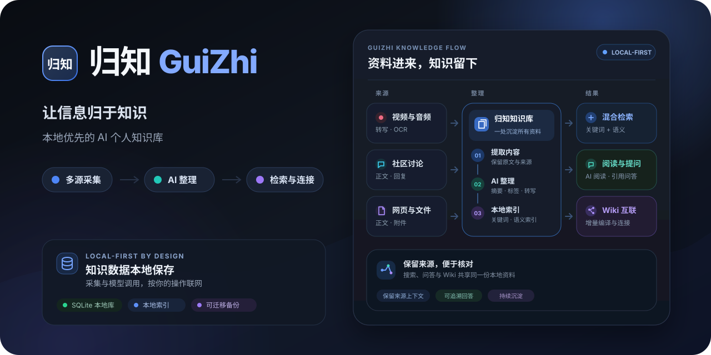
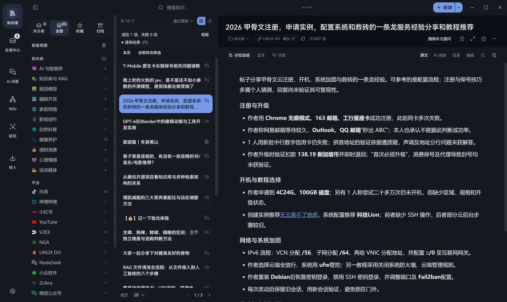

  

  
  
  

  <a href="#下载安装">下载安装</a> ·
  <a href="#快速上手">快速上手</a> ·
  <a href="./docs/README.md">使用文档</a> ·
  <a href="./docs/building.md">源码构建</a>

归知把网页、笔记、图片和音视频收进个人知识库，用 AI 整理、检索与问答，
并将资料编织成互相链接的 Wiki。

无需注册归知账号。知识库与备份保存在本机；采集在线内容和调用 AI 模型时需要联网。

  

## 你可以用归知做什么

- **收集资料**：导入网页、本地文件和平台分享链接，支持抖音、哔哩哔哩、小红书、YouTube 等来源。
- **整理知识**：用知识库、标签和全文检索管理资料，借助 AI 生成摘要、识别图片和转写音视频。
- **理解与复用**：围绕资料提问、生成阅读页，将积累的内容编织成 Wiki。
- **掌握数据**：备份恢复、导出 Markdown，也可通过 MCP 将知识库接入 Cursor / Codex。

## 下载安装

**[下载最新 Windows 安装包](https://github.com/Couleur-Share/GuiZhi/releases/latest)**，选择 `GuiZhi-Setup-<版本>-x64.exe`。

官方仅支持 **Windows 11+ x64**。Linux / macOS 不再提供官方安装包、平台测试及兼容性保证，
有需要的用户可[从源码自行构建](./docs/building.md)。

安装包暂未做正式代码签名。Windows SmartScreen 提示时，选择「更多信息 → 仍要运行」。

## 快速上手

1. 打开「设置 → 模型服务」，配置主文本与快速模型。
2. 按 `Alt+Shift+N` 粘贴网页链接，或导入本地文件。
3. 在知识库中查看资料、整理标签，使用搜索或围绕资料提问。
4. 积累资料后，在 Wiki 中点击「立即编译」。

不配置 AI 也能使用采集、编辑、标签、全文检索和备份导出。
详细步骤见[快速上手](./docs/getting-started.md)。

## 文档与反馈

- [完整文档](./docs/README.md) · [功能说明](./docs/features.md) · [采集平台](./docs/capture-platforms.md)
- [模型配置](./docs/ai-models.md) · [数据与备份](./docs/data.md) · [MCP 接入](./docs/mcp.md)
- [已知限制](./docs/known-limitations.md) · [源码构建](./docs/building.md) · [更新记录](./CHANGELOG.md)
- [问题反馈](https://github.com/Couleur-Share/GuiZhi/issues) · [讨论交流](https://github.com/Couleur-Share/GuiZhi/discussions)

## 许可证与致谢

采用 [GNU AGPL v3.0](./LICENSE)（`AGPL-3.0-only`）。

应用骨架源自 [PromptHub](https://github.com/legeling/PromptHub) v0.5.9，
感谢 legeling 与所有贡献者。归属说明见 [NOTICE](./NOTICE)。
